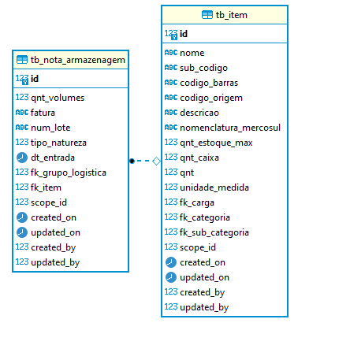
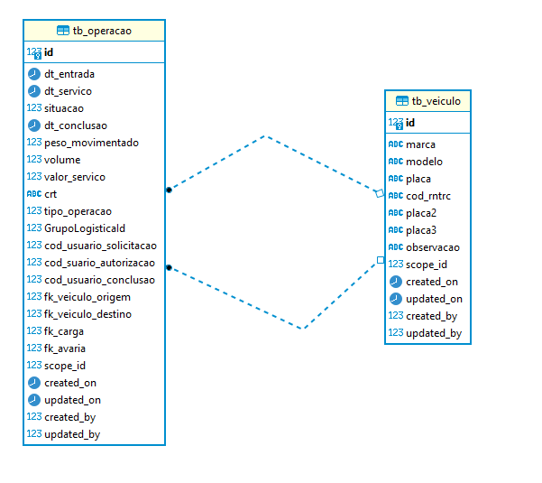
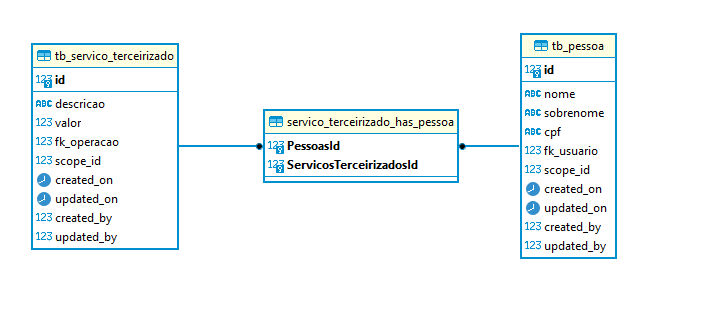

# Auto API
## _Tudo que pode ser automatizado, deve ser_

AutoApi é um projeto para se criar API's automaticamente por meio de apenas um arquivo .SQL, ou através de comandos complementares para gerar um "esqueleto" a partir de um Model feito.

## Abstração
O principal foco do AutoApi é o método de abstração, eficiência de código e o mínimo de repetição possível. Ainda esta em desenvolvimento, mas toda corrida começa com o primeiro passo.

A pasta /TemplateFiles possuí os templates para o melhor entendimento da técnica de abstração utilizada. Recomenda-se ver o serviceTemplate, controllerTemplate, dtoTemplate e repositoryTemplate.

## 
> Instalação de Python 3, (listar libs)
> Instalação do .Net

## Comandos de exemplo
O comando phandler aceita uma função para múltiplos projetos.

```sh
$ python3 generator.py -p NomeDoProjeto arquivo.sql
```

Para atualizar vários projetos por exemplo:
```sh
$ python3 generator.py $parametros
```

### Parâmetros
| Parâmetro | Descrição |
| ------ | ------ |
| `-p` | Nome do Projeto em CammelCase |
| `-t` | Tipo de projeto {webapi} |
| `-c` | Gerar configuração |
| `-m` | Gerar control, repository e service a partir de um projeto cru com model |
| `-s` | Arquivo .sql para se  |

### Clique na imagem abaixo para ver um vídeo de demonstração
[](https://youtu.be/0QLqWdOPMeQ "Everything Is AWESOME")

---

# Métodos de relacionamento utilizados >>

# One to One // 1-1

Relacionamento exemplo:


## NpgContext.OnModelCreating()
```cs
 protected override void OnModelCreating(ModelBuilder modelBuilder)
        {
            /* Relacionamentos */
            /* one to one start */
            //(1)NotaArmazenagem - (1)Item - fk_item
            modelBuilder.Entity<Item>()
                .HasOne(i => i.NotaArmazenagem)
                .WithOne(n => n.Item);
            // .HasForeignKey<NotaArmazenagem>(n => n.ItemId);
```
## Model NotaArmazenagem
```CS
...
        /* Relacionamentos */
        [ForeignKey("fk_grupo_logistica")]
        public GrupoLogistica GrupoLogistica { get; set; }

        [ForeignKey("fk_item")]
        [Required]
        public Item Item { get; set; }
...
```
## Model Item
```cs
...
        /* Relacionamentos: Mapeamento ef */
        public NotaArmazenagem NotaArmazenagem { get; set; }
...
```

---

# One to Many // 1-n

Relacionamento exemplo:


## NpgContext.OnModelCreating()
```cs
            /* one to many start */
            // (1)Veiculo - (n)Operacao - fk_veiculo_origem
            modelBuilder.Entity<Veiculo>()
                .HasMany(v => v.OrigensOperacao)
                .WithOne(o => o.VeiculoOrigem);

            // (1)Veiculo - (n)Operacao - fk_veiculo_destino
            modelBuilder.Entity<Veiculo>()
                .HasMany(v => v.DestinosOperacao)
                .WithOne(o => o.
```
## Model Veiculo (1)
```CS
...
       /* Relacionamentos: Mapeamento ef */
        public ICollection<Operacao> DestinosOperacao {get; set;}
        public ICollection<Operacao> OrigensOperacao {get; set;}
...
```
## Model Operação (n)
```cs
...
        /* Relacionamentos */
        [ForeignKey("fk_veiculo_origem")]
        public Veiculo VeiculoOrigem { get; set; }
        
        [ForeignKey("fk_veiculo_destino")]
        public Veiculo VeiculoDestino { get; set; }
...
```

---

# Many to Many // n-n

Relacionamento exemplo:


## NpgContext.OnModelCreating()
```cs
            /* many to many start */
            // ServicoTerceirizado(n) - (n)Pessoa
            modelBuilder.Entity<ServicoTerceirizado>()
                .HasMany(left => left.Pessoas)
                .WithMany(right => right.ServicosTerceirizados)
                .UsingEntity(join => join.ToTable("servico_terceirizado_has_pessoa"));
```
## Model Pessoa (n)
```CS
...
        /* Relacionamentos: Mapeamento ef n-n */
        public ICollection<ServicoTerceirizado> ServicosTerceirizados { get; set; }
...
```
## Model ServicoTerceirizado (n)
```cs
...
         /* Relacionamentos: Mapeamento ef n-n */
        public ICollection<Pessoa> Pessoas { get; set; } = new Collection<Pessoa>();
...
```

---